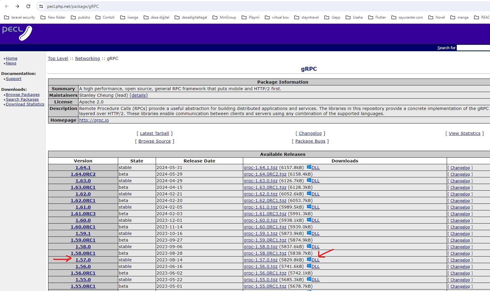
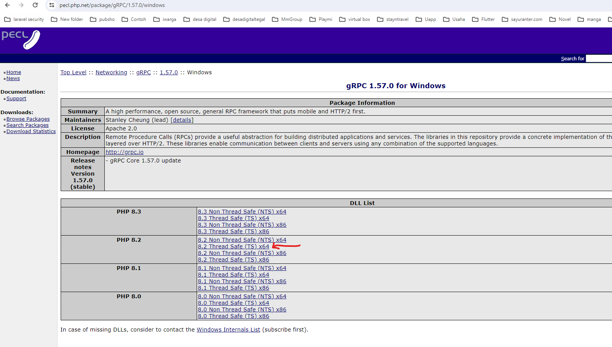
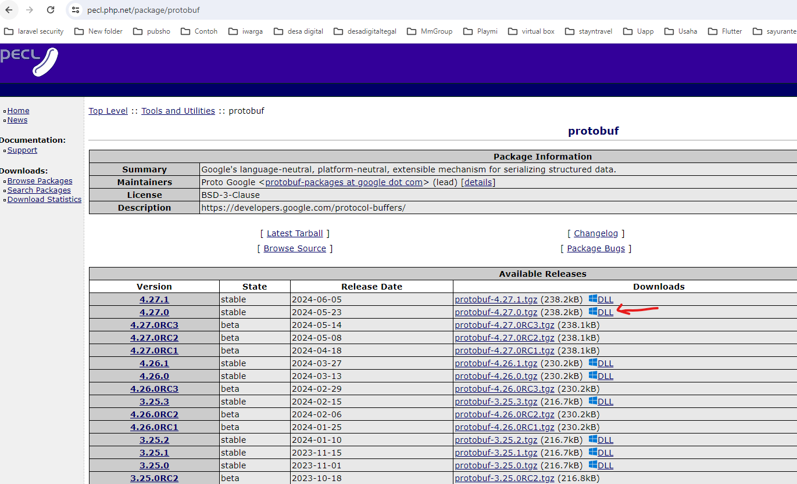
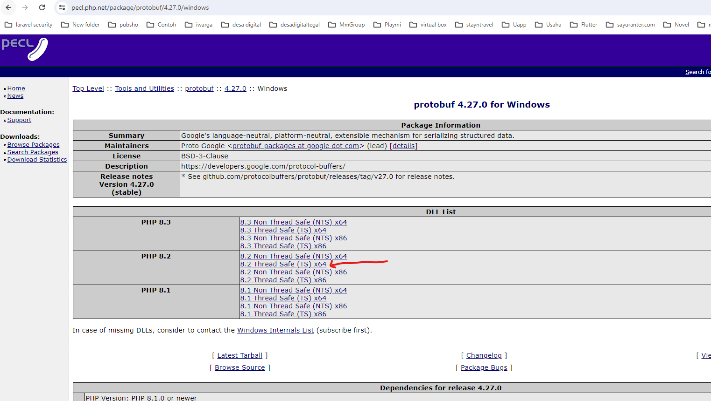

## Running Bengkel

* cek versi php
- gunakan command prompt dan ketik php -v
- usahakan versi 8.2

* install manual via panduang chatgpt. ketik: grpc in xampp




extract and copy paste to folder xampp/php/ext

* install manual protobuff, download sesuai dibawah. cek juga link websitenya



extract and copy paste to folder xampp/php/ext

* add extension grpc to php.ini
extension=grpc
extension=protobuf

* aktifkan di php.ini
extension=soap
extension=sockets
extension=sodium

* install composer
```
composer install --ignore-platform-reqs
```

* vendor publish
```
php artisan vendor:publish
```
select all. or ketik: 0